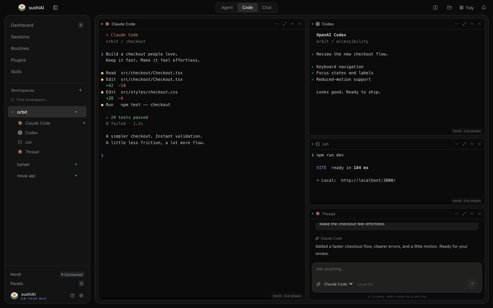

<p align="center"></p>
<h1 align="center">sushiAI</h1>
<p align="center">Your agents. One workspace.<br>A terminal workspace for macOS · Herdr · MIT</p>



**sushiAI** brings agent terminals, chats, files, and Git diffs into one macOS window. Run Claude Code, Codex, Gemini CLI, and Cursor Agent with your installed tools and accounts. Use local terminals or persistent Herdr sessions, including over SSH.

[Watch the demo](promo/sushiAI-launch.mp4) · [Download 0.0.4](https://github.com/sushi-killer/sushiAI/releases/tag/v0.0.4) · [Installation guide](docs/INSTALL.md)

The demo uses fictional projects and sample data.

## Install

**[Download the Apple Silicon DMG](https://github.com/sushi-killer/sushiAI/releases/download/v0.0.4/sushiAI-0.0.4-arm64.dmg)** — requires an M1 or newer Mac running macOS 13 or later.

Open the DMG, drag sushiAI to Applications, and launch it. This build is ad-hoc signed and is not Apple-notarized. See the [installation guide](docs/INSTALL.md) for first-launch instructions, checksums, tool setup, and [building from source](docs/INSTALL.md#build-from-source).

**Upgrading from 0.0.1 Alpha:** install this DMG manually once to enable in-app updates for future releases.

## Features

- **Agent terminals:** streaming input and output, resizing, and icons for the running agent.
- **Flexible workspaces:** draggable split panels, resizable dividers, and tabs that adapt to smaller windows.
- **Session management:** add shells and agents, search sessions, hide views, or end selected sessions.
- **Local and remote projects:** connect to Herdr over SSH using your existing SSH configuration.
- **Files and previews:** browse directories, read text, view images and PDFs, and preview static HTML with relative assets.
- **Text editing:** edit UTF-8 files with conflict detection if an agent changes the file before you save.
- **Git diffs:** inspect the current branch, working-tree changes, and staged changes.
- **Software updates:** check GitHub Releases automatically and download a verified DMG when an update is available.
- **Agent chats:** use Claude Code or Codex through their installed CLIs.
- **Chat tab:** threads per project with pinning, renaming and a project picker on **+**. Each thread keeps its agent, model, effort and permission mode; attach files and folders with **+** or by dropping them into the composer.
- **Live model list:** Codex models, their reasoning levels and your configured defaults are read from the installed CLI, so a new release appears without updating sushiAI. Codex turns report progress and real token usage while they run.

## Workspaces and sessions

Use **+**, **⌘K**, or **⌘T** to add a terminal, agent, browser, Files & Git panel, or chat. Drag a panel header to another panel's center to swap them, or to its edge to split the layout. Drag dividers to resize panels; double-click a header to maximize it. **Tidy** restores and balances the layout.

When space is limited, panels switch to tabs and the sidebar collapses. You can also select tab mode from the toolbar.

Open **Sessions** to search and filter sessions or end several at once. For Herdr sessions, **Hide** removes the view while **End** stops the underlying process. Use the workspace menu to rename or close a workspace and its sessions.

Local terminals stop when sushiAI quits. Herdr sessions continue independently of the app. Save file edits before quitting; unsaved drafts are kept only in memory. Use terminal panels when an agent requires interactive approval.

## Connect to Herdr

Install and start [Herdr](https://github.com/ogulcancelik/herdr) before connecting. Compatibility has been tested with Herdr **0.8.0 / protocol 19**. Local terminals also work without Herdr.

The default local socket is `~/.config/herdr/herdr.sock`. Set another socket in Settings or through `HERDR_SOCKET_PATH`.

For a remote project:

1. Verify that SSH works in Terminal and accept the host key if prompted.
2. Open **Settings → Connections → Add SSH host**.
3. Enter an SSH alias or `user@host`, an optional port, and the remote Herdr socket.
4. Choose **Save and connect**, then open a workspace or create one using an absolute remote project path.

Named Herdr sessions usually use `~/.config/herdr/sessions/<session-name>/herdr.sock`. The remote host needs Herdr, Python 3, Git, and the agent CLIs you want to run.

sushiAI uses your system SSH configuration, keys, and agent. Remote browser URLs such as `http://localhost:3000` are forwarded through SSH automatically. A Herdr terminal supports one controlling client; if another client holds control, disconnect it before choosing **Reconnect**.

## Files and editing

Open **Files & Git** with the folder button in the toolbar. Choose **Edit**, then **Save** or **⌘S** to update an existing UTF-8 file up to 2 MB. If the file changes on disk, saving is rejected and your draft remains available.

File previews support files up to 16 MB; text output is limited to 2 MB. Static HTML previews support relative assets. Open development servers by URL in a browser panel. Git views show changes; use a terminal for commits and other Git operations.

## Software updates

Open **Settings → Software updates** to check for a new release. Packaged builds check this project's public GitHub Releases shortly after startup and every six hours. Automatic downloads and alpha/beta releases can be enabled or disabled separately. Development builds check only when requested.

When a compatible update is found, an indicator appears in the toolbar and Notifications. Downloads are verified against the release asset's SHA-256 digest. Choose **Install and restart** to apply a downloaded update. The installer verifies the DMG and application signature, prepares a new copy, waits for sushiAI to exit, replaces the app, and reopens it. A recovery copy is kept until the new version loads; replacement failures restore the previous app. Save edits first: local terminals stop during the restart, while Herdr sessions continue running. Automatic downloads never trigger installation on their own.

Install sushiAI in a writable Applications folder before updating; an app running directly from a mounted DMG cannot replace itself. Development builds offer **Open installer** for manual installation instead.

Updates use the Mac's architecture, ignore draft releases and older versions, and require a matching uploaded DMG. A failed network request can be retried from Settings. No GitHub account or access token is required.

## Keyboard shortcuts

| Action                             | Shortcut            |
| ---------------------------------- | ------------------- |
| Add a panel or session             | ⌘K / ⌘T             |
| Close the selected panel           | ⌘W                  |
| Select panel 1–9                   | ⌘1 … ⌘9             |
| Next / previous panel              | ⌘⇧] / ⌘⇧[           |
| Navigate a focused tab bar         | ← / →, Home / End   |
| Toggle sidebar                     | ⌘B                  |
| Maximize selected panel            | ⌘Enter              |
| Exit maximized view or dialog      | Esc                 |
| Save a text file                   | ⌘S                  |
| Send a message / insert a new line | Enter / Shift Enter |

## Development

Requires Node.js 22.18+, npm, and Xcode Command Line Tools.

```sh
git clone https://github.com/sushi-killer/sushiAI.git
cd sushiAI
npm ci
npm run dev
```

```sh
npm test              # Unit tests
npm run build         # Type checking and production build
npm run test:desktop  # Desktop integration tests; requires local Herdr
npm run test:herdr    # Herdr session lifecycle
npm run test:stream   # Terminal stream, input, and resize
```

For SSH integration tests, set `SUSHIAI_SSH_HOST` to your test host and `SUSHIAI_SSH_SOCKET` to its Herdr socket, then run `npm run test:remote`. Without a socket override, SSH tests use `~/.config/herdr/sessions/sushiai/herdr.sock`. Integration tests create temporary workspaces and files and clean them up afterward.

Run `node scripts/updates-smoke.mjs` for isolated desktop checks of the update flow using synthetic release data.

See the [build instructions](docs/INSTALL.md#build-from-source) to package the app. `npm run dev:web` provides a UI preview; terminals, SSH, editing, and CLI chats require the desktop app.

## License

sushiAI source and original demo media are available under the [MIT License](LICENSE). Dependencies and icons retain their respective licenses; see [third-party notices](THIRD_PARTY_NOTICES.md). sushiAI is an independent project.
