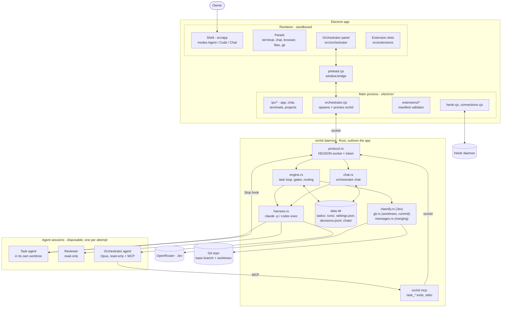
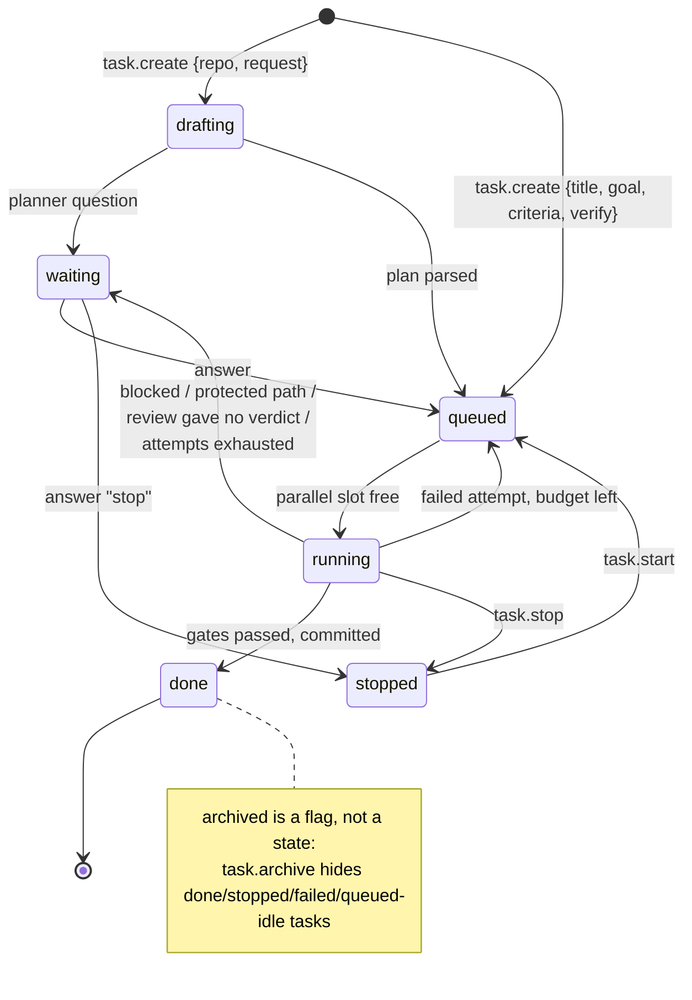
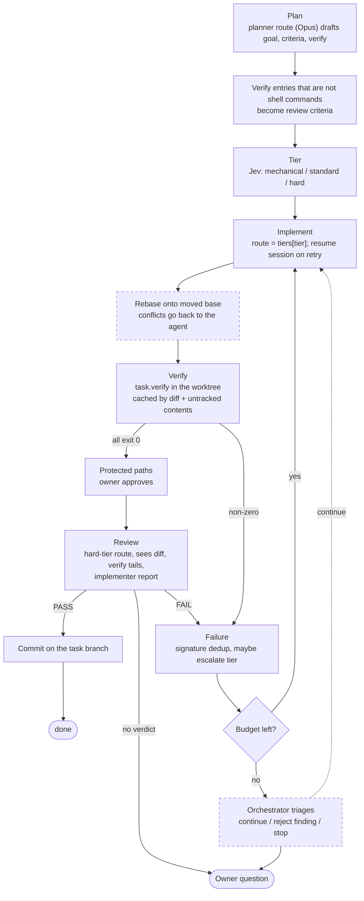
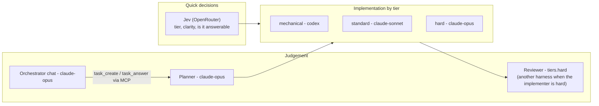
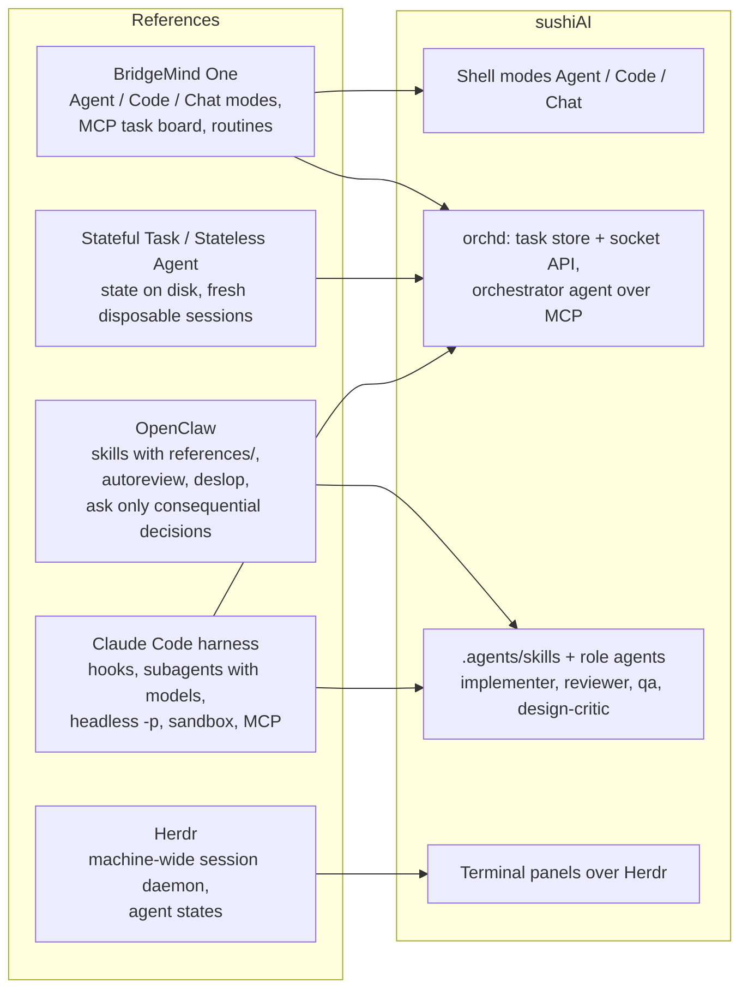
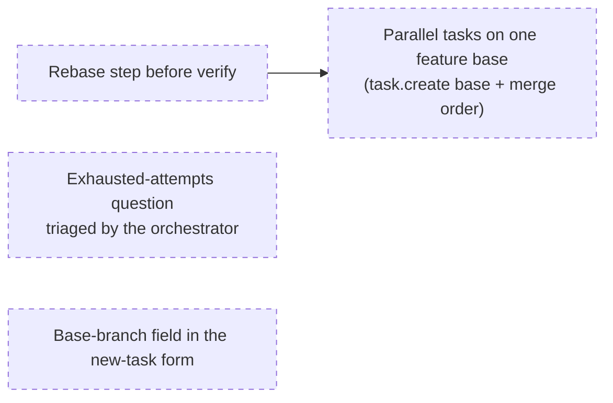

# sushiAI architecture

A living map of how the pieces fit, drawn in Mermaid so it can be edited next
to the code and reviewed in a diff. Obsidian and GitHub render it as is; VS
Code needs a Mermaid preview extension. Dashed edges and `planned` nodes are
agreed but not built yet. When a change moves a box or an arrow here, update
this file in the same commit.

## 1. System overview

## 2. Task lifecycle

## 3. One attempt: from plan to commit

## 4. Roles and models

Task agents run with `sandbox: host` today: macOS Seatbelt blocked Electron,
`/tmp` and socket tests, so agents could not screenshot or run the suite. The
worktree is the boundary, stated in the brief.

## 5. What we took from references

## 6. Planned next

