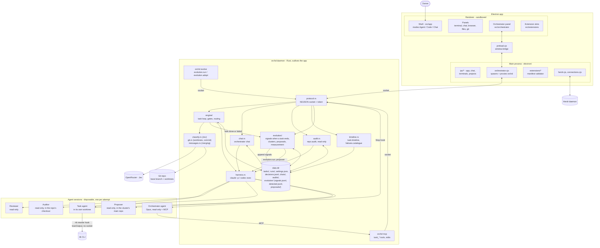
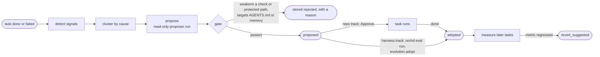
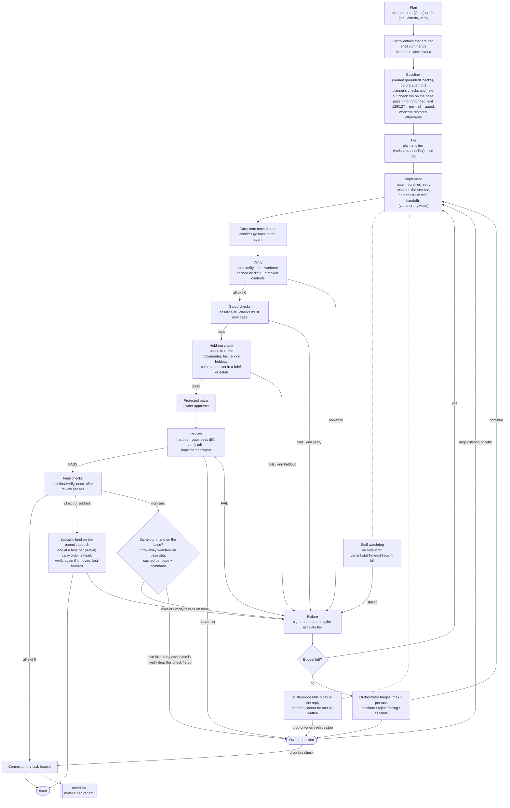
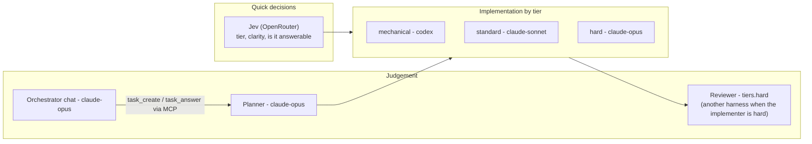
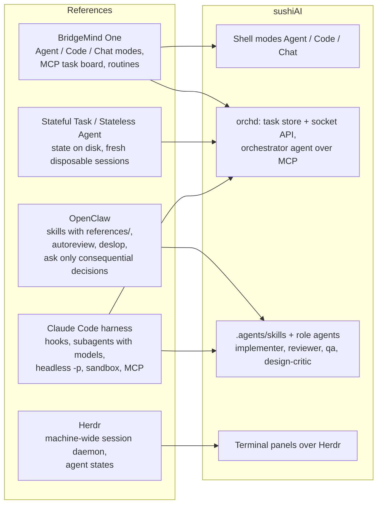
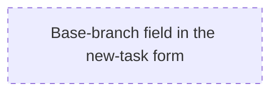

# sushiAI architecture

A living map of how the pieces fit, drawn in Mermaid so it can be edited next
to the code and reviewed in a diff. Obsidian and GitHub render it as is; VS
Code needs a Mermaid preview extension. Dashed edges and `planned` nodes are
agreed but not built yet. When a change moves a box or an arrow here, update
this file in the same commit.

## 1. System overview

## 2. Task lifecycle

```mermaid
stateDiagram-v2
  [*] --> drafting: task.create {repo, request}
  [*] --> queued: task.create {title, goal, criteria, verify}
  drafting --> waiting: planner question
  drafting --> queued: plan parsed
  drafting --> running: plan split into subtasks<br/>(the task becomes their parent)
  queued --> running: parallel slot free,<br/>every dependsOn task done
  queued --> waiting: a dependsOn task or child<br/>ended failed/stopped
  running --> waiting: blocked / protected path /<br/>review gave no verdict /<br/>attempts exhausted
  waiting --> queued: answer
  running --> queued: failed attempt, budget left
  running --> done: gates passed, committed<br/>(a subtask: landed on its parent's branch;<br/>a parent: every child landed, its checks passed)
  running --> stopped: task.stop
  waiting --> stopped: answer "stop"
  stopped --> queued: task.start
  done --> [*]
  note right of done
    archived is a flag, not a state:
    task.archive hides done/stopped/failed/queued-idle tasks
  end note
```

A task graph is state orchd keeps, never a split it decides: the planner
may answer a top-level request with `subtasks` (keys, requests, `dependsOn`
between keys), or the orchestrator agent builds one with `task.create
{parent, dependsOn}`. A parent runs no implement attempt; each child
branches from the parent's branch, is drafted and run as a normal task, and
starts implementing only once its `dependsOn` tasks are done (it syncs to
the parent's head first, so it sees their work). A finished child lands
through a per-parent merge queue: its work is carried onto the parent's
current head, verify runs again when that head moved, and the parent's
branch fast-forwards to the child's commit; a conflict or failing verify is
an ordinary failure the agent retries. When every child has landed, the
parent runs its own verify and final checks on its branch (with
`groundedChecks`, its checks were baselined before the first child started and
its gated and held-out checks run once here) and is done; its
cost is its plan plus its children. When something a task waits for ends
`failed`/`stopped`, the task waits with a question: retry the dependency,
drop it, or stop.

## 2b. Evolution flow

## 3. One attempt: from plan to commit

## 4. Roles and models

Task agents run with `sandbox: host` today: macOS Seatbelt blocked Electron,
`/tmp` and socket tests, so agents could not screenshot or run the suite. The
worktree is the boundary, stated in the brief.

## 5. What we took from references

## 6. Planned next

