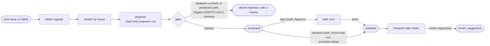
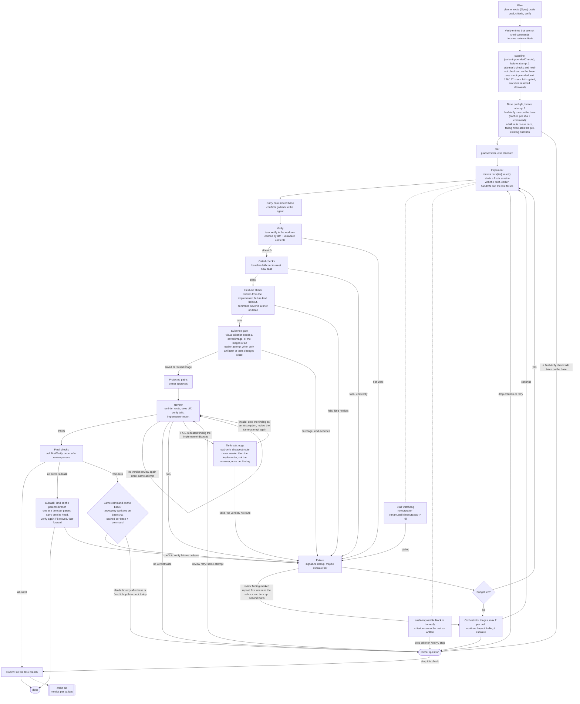
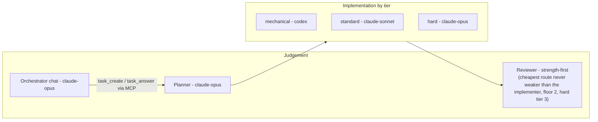
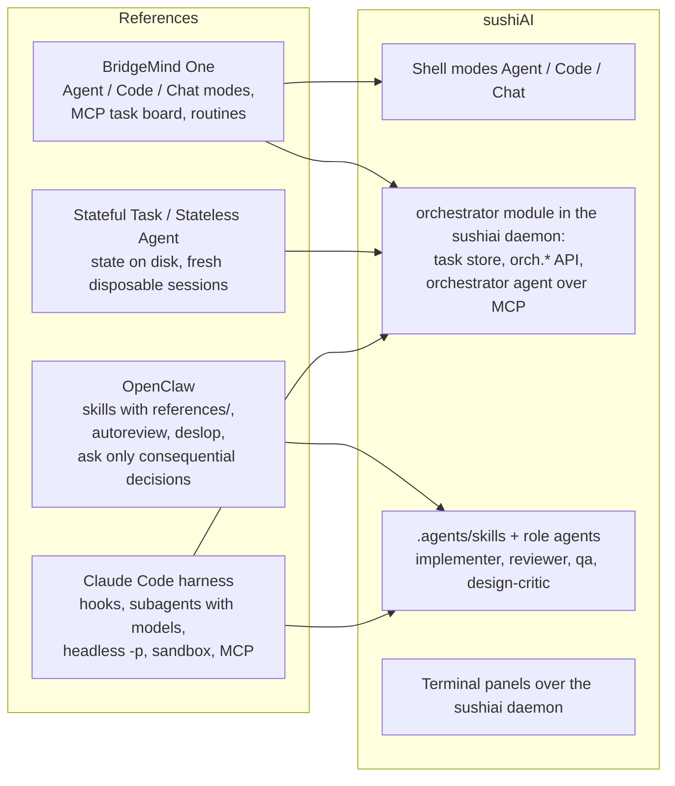

# sushiAI architecture

A living map of how the pieces fit, drawn in Mermaid so it can be edited next
to the code and reviewed in a diff. Obsidian and GitHub render it as is; VS
Code needs a Mermaid preview extension. Dashed edges and `planned` nodes are
agreed but not built yet. When a change moves a box or an arrow here, update
this file in the same commit.

## 1. System overview

```mermaid
flowchart TB
  owner([Owner])

  subgraph app["Electron app"]
    direction LR
    subgraph renderer["Renderer - sandboxed"]
      direction TB
      shell["Shell - src/app<br/>modes Agent / Code / Chat"]
      panels["Panels<br/>terminal, chat, browser, files, git"]
      orchPanel["Orchestrator panel<br/>src/orchestrator"]
      slots["Extension slots<br/>src/extensions"]
      previewPane["Preview pane - src/extensions/preview<br/>core view of builtin.artifacts: Markdown,<br/>sandboxed HTML, images, PDF; comments; Start task"]
      inbox["Inbox page - src/app/InboxPage.tsx<br/>inboxModel.ts, attention.ts, useAttention.ts<br/>queue, badge count, reminders"]
      wsState["src/workspaceState.ts<br/>layout, panes, mode"]
    end
    subgraph mascotWin["Mascot window - second BrowserWindow, sandboxed"]
      mascotPage["src/mascot<br/>notice bubbles, pill, character"]
    end
    preload["preload.cjs<br/>window.bridge"]
    mascotPreload["mascot-preload.cjs<br/>window.mascot"]
    subgraph main["Main process - electron/"]
      direction TB
      ipc["ipc/* - app, chat, daemon,<br/>projects"]
      orchSvc["orchestrator.cjs<br/>spawns + proxies orchd; the Extensions switch<br/>(builtin.orchestrator, the only disableable built-in)<br/>calls OrchestratorHosts.setEnabled, and while off<br/>every IPC rejects with ORCHESTRATOR_OFF"]
      extMgr["extensions/*<br/>manifest validator"]
      conns["connections.cjs<br/>SSH profiles, exec, inspect, port forwards"]
      daemonMgr["daemon/manager.cjs, client.cjs, connectors.cjs, local.cjs<br/>one connection per host: local socket, ssh proxy or command;<br/>state, reconnect, session events"]
      sessionLaunch["session-launch.cjs<br/>host checkout + worktree, environment and accounts,<br/>then session.create with an idempotency key"]
      terminalFlow["daemon/terminals.cjs, terminal-flow.cjs<br/>attach, bounded output credit + xterm acknowledgements"]
      hostInstall["host-install.cjs, host-setup.cjs<br/>install and update sushiai on a host"]
      remoteSvc["orchestrator-remote.cjs<br/>install, start, forward, preflight<br/>per SSH profile"]
      projectStore[("sushiai.db<br/>projects, folders, safeStorage secrets")]
      gitSsh["project-git-ssh.cjs<br/>public key + Git server trust recovery"]
      attention["attention.cjs<br/>tray, Dock badge, notifications,<br/>close-to-menu-bar, app preferences"]
      mascotSvc["mascot.cjs<br/>mascot window, notice queue,<br/>mascot-* IPC, presenting watch"]
      winState["window-state.cjs<br/>bounds, display, maximized"]
      wsSnap["workspace-snapshot.cjs<br/>sync read/flush + async write"]
      devRestart["dev-restart.cjs<br/>watches electron/ in npm run dev"]
      previewSrv["preview.cjs<br/>token-granted file server;<br/>comment script for annotate HTML grants"]
      artSkill["artifacts-skill.cjs + extensions/builtin-skills.cjs<br/>global sushiai-artifacts skill in ~/.claude, ~/.codex, ~/.agents,<br/>CLAUDE_CONFIG_DIR / CODEX_HOME, Codex account homes, SSH hosts; removed when disabled"]
    end
    orchPanel <--> preload <--> orchSvc
    orchSvc --> remoteSvc --> conns
    projectStore -->|host values over forwarded socket;<br/>session values in session.create env over the daemon protocol| remoteOrchd
    projectStore -->|"prepare: clone + install over ssh,<br/>values on stdin (none for a host switched off)"| remoteHost[("SSH host ~/sushiai/slug")]
    ipc --> gitSsh
    gitSsh -->|key stays on host;<br/>public key and fingerprints to UI| remoteHost
    panels <--> preload <--> sessionLaunch
    sessionLaunch --> daemonMgr
    daemonMgr -->|"daemon-state, daemon-event"| preload -->|"useDaemon: reconcileSessions"| wsState
    panels <-->|"attach, input, resize, acknowledgement"| preload <--> terminalFlow
    terminalFlow --> daemonMgr
    hostInstall --> conns
    hostInstall --> daemonMgr
    inbox -->|attention-badge, attention-notify| preload --> attention
    wsState <-->|workspace-state-read / -flush sendSync,<br/>-write invoke| preload <--> wsSnap
    orchSvc -->|task notice| attention
    attention -->|desktop mascot on| mascotSvc
    mascotPage <-->|mascot-* IPC| mascotPreload <--> mascotSvc
    mascotSvc -->|task.answer, land, rerun| orchSvc
    mascotSvc & attention -->|orchestrator-open, open-inbox,<br/>attention-open| preload
    devRestart -->|Core updated notice| mascotSvc
    wsState -->|"session.open -> useOpenSignals:<br/>open a core surface as the companion half of the agent pane"| previewPane
    previewPane <-->|"project-preview (annotate), project-inspect read"| preload <--> previewSrv
    previewPane -->|"comments: session.input;<br/>Start task: session launch with a prompt /goal"| preload
    shortcut(["global Alt+Space"]) -->|fold / unfold| mascotSvc
  end
  macos[("macOS tray, Dock,<br/>Notification Center")]
  profile[("userData<br/>sushiai.db")]
  attention --> macos
  wsSnap & winState --> profile

  subgraph orchd["orchestrator module (crates/sushiai-orch) - hosted by the sushiai daemon, loaded only when the Orchestrator extension is on; desktop calls orch.* over the daemon connection and receives orch.event; file-backed runs are re-adopted by process group after a daemon restart"]
    direction LR
    proto["protocol.rs<br/>orch.* request and result types"]
    engine["engine/<br/>task loop, gates, routing"]
    chat["chat.rs<br/>orchestrator chat"]
    audit["audit.rs<br/>repo.audit, read-only"]
    insights["timeline.rs<br/>task.timeline, failures.catalogue"]
    evolution["evolution/<br/>signals when a task ends,<br/>clusters, proposals, measurement"]
    evolveCli["orchd evolve<br/>evolution.run / evolution.adopt"]
    costs["costs.rs<br/>costs.summary, orchd costs"]
    harness["harness.rs<br/>claude -p / codex exec"]
    side["git.rs (worktrees, commit)<br/>messages.rs (merging)"]
    store[("data dir<br/>tasks/, runs/, settings.json,<br/>costs.jsonl, chats/, audits/,<br/>evolution/ (signals.jsonl, detected.jsonl,<br/>proposals/)")]
    mcp["orchd mcp<br/>task_* tools, stdio"]
    chatTools["engine/chat_tools.rs<br/>connected MCP servers, OK-card writes"]
    mcpConfig[("owner's MCP config<br/>~/.claude.json, plugins")]
    prompts[("prompts/orchestrator.yaml<br/>+ data dir prompts.yaml override")]
    skill[("~/.claude, ~/.codex, ~/.agents skills<br/>sushiai-orchestrator (serve --install-skill)")]
    chat & mcp -->|prompts| prompts
    engine -->|installs| skill
    chat --> chatTools
    chatTools -->|read at turn time| mcpConfig
    proto --> engine & chat & audit & insights & evolution & costs
    engine --> side
    engine -->|task done or failed| evolution
    evolution -->|append signals| store
    evolution -->|evolution.run: proposer run, read-only| harness
    evolveCli -->|socket| proto
    engine & chat & audit --> harness
    engine & chat & audit & evolution <--> store
    insights & costs --> store
    engine & chat & audit & evolution -->|one record per run| costs
    mcp -->|socket| proto
  end

  subgraph agents["Agent sessions - disposable, one per attempt"]
    direction LR
    taskAgent["Task agent<br/>in its own worktree"]
    reviewer["Reviewer<br/>read-only"]
    auditor["Auditor<br/>read-only, in the repo's checkout"]
    proposer["Proposer<br/>read-only, in the cluster's main repo"]
    orchAgent["Orchestrator agent<br/>Opus, read-only + MCP"]
  end

  repo[("Git repo<br/>base branch + worktrees")]
  sushiaiDaemon["sushiai daemon - one per host (crates/)<br/>local: ~/.sushiai/daemon.sock, started by the app;<br/>remote: reached through sushiai proxy over ssh.<br/>Sessions live in sushiai hold processes that outlive the daemon and the app"]
  holders[("sushiai hold processes<br/>one per session: pty, screen, scrollback")]

  owner --> shell
  orchSvc <-->|socket| proto
  harness --> taskAgent & reviewer & auditor & proposer & orchAgent
  orchAgent -->|MCP| mcp
  taskAgent -->|Stop hook| proto
  side --> repo
  daemonMgr <-->|"NDJSON frames: sessions, attach, asks, catalog"| sushiaiDaemon
  sushiaiDaemon <--> holders
  holders -->|"agent hooks: sushiai hook, sushiai open"| sushiaiDaemon
  remoteSvc <-->|shared ssh master,<br/>forwarded orchd.sock + token| remoteOrchd[("orchd on an SSH host<br/>detached, outlives the app")]
  remoteOrchd -->|task agent env + project MCP| taskAgent
```

The app talks to one `sushiai` daemon per host. `electron/daemon/manager.cjs` owns a connector per host (`local`: the daemon socket in `$SUSHIAI_HOME` or `~/.sushiai`, started by the app when missing; `ssh`: `sushiai proxy` over the host's ssh; `command`: a local command that speaks the protocol on stdio) and publishes `daemon-state` and `daemon-event` to the renderer. The renderer never opens a socket: `useDaemon` lists the sessions of each ready host once, then applies events, and `reconcileSessions` binds every panel to its session by `panel.sessionId` (a session that is gone ends its panel with Reopen; a saved panel without a `sessionId` restores ended). Terminals attach through `daemon/terminals.cjs` (a snapshot, then output with a byte credit and acknowledgements; xterm keeps the scrollback). Sessions are held by `sushiai hold` processes, so the daemon can be killed or upgraded and the app can quit or crash without ending a session; on the next start the panels reattach to the same screens. Agents report status through hooks (`sushiai hook`), ask for permission through the daemon (Inbox **Allow** and **Deny** answer it) and ask for a Preview with `sushiai open <extension>/<surface> <path>`, which the daemon delivers as a `session.open` event. A remote host gets `sushiai` from **Connections → Install** (`createHostInstaller` in `host-setup.cjs`: upload over ssh, sha256 check, atomic link, hooks installed, daemon restarted). Project and group catalogs sync to every daemon (`catalog-sync.cjs`).

A `session.open` event opens a Preview: `src/extensions/useOpenSignals.ts` acts on each new event once and opens the builtin core surface as the companion half of that pane (one pane, a draggable seam, hidden and shown from the pane header), without moving focus. Only `view.kind: "core"` surfaces, which only builtins may declare, can be opened this way. The Preview reads files only inside its workspace folder, through the main process with the project as root, so a symlink out of it is refused. HTML runs in an `allow-scripts` iframe without same-origin, so it cannot reach `window.bridge`; the injected comment script only posts what the owner pointed at.

App state lives in one database, `sushiai.db` (`node:sqlite`, `electron/app-db.cjs`, one cached handle per profile, WAL, owner-only file mode, migrations on `user_version`). Each old JSON store (`projects.json`, `workspace-state.json`, `connections.json`, `orchestrator-hosts.json`) is imported once into its tables and renamed `<name>.imported`. The renderer's workspace snapshot keeps its IPC (`workspace-state-read/write/flush`); the main process splits it into `workspaces` rows (the id is the daemon group) and `app_state` keys, and writes only what changed in one transaction. SSH connection profiles and enabled orchestrator hosts are tables too. Every other main-process store (model providers and profiles, Claude and Codex account lists, provider and project secrets, window bounds, update settings, app preferences) is a named map in the generic `store(name, key, value)` table, read with `readStore` and written with `writeStore`/`putStore` (changed keys only, one transaction). Secrets keep their `safeStorage` ciphertext, whose key lives in the macOS Keychain; when secure storage is unavailable, provider keys fall back to unencrypted storage, as before. Files stay files only where another program reads them or they can be regenerated: Codex homes, CLI settings staged for a launch, extension manifests, attachments, update downloads, the skills catalog cache. `scripts/check-conventions.mjs` fails on a new `*.json` name under `electron/` that is not on its allowlist. Project metadata is a `projects` table and a `folders` table keyed by host and path, which holds each folder's attached project and its last git identity (remote key, common dir, checkout, branch); environment and account values are stored in the `project-secrets` store, encrypted through Electron `safeStorage`, and deleted in the same transaction as their project. The renderer receives presence and masked hints, while the main process resolves values for the selected project, stage, and host. Local sessions receive their stage-specific environment at launch. Every SSH host the owner added receives a project's values (adding the host is the consent) unless the owner switched sending off for that project and host; remote task values cross through the forwarded orchd socket; remote session values travel in `session.create` `env` over the daemon protocol (through the ssh proxy) and live only in the holder's environment and the daemon's memory, never in `argv` or `state.json`. Codex accounts are not values in that store: each one is its own Codex home under userData (`codex-accounts/<id>`), signed in by `codex login` and refreshed by Codex itself, with the rest of `~/.codex` linked in. A local session runs Codex with `CODEX_HOME` set to it; an SSH session gets the account's login through the same `session.create` `env`, for that session only. A ChatGPT login refreshed there (its refresh token is single-use) is left in a named session home on the host and collected over SSH at the account's next start, the newer login winning. Switching sending off prevents later reads from including that host's project values and replaces what that host's daemon already holds (when the host is offline, at the next connection).

Every writer of the project store (`upsert`, `updateEnv`, `updateMcp`, `mergeImport`, `setSecret`, `setHostSecret`, `clearSecret`, `setHostWithheld`, `setHostOverrides`, `setGitToken`, `delete`) runs one at a time under a single lock and reads fresh state; `upsert` never rewrites the variables or MCP servers of an existing project, and ids that are not own keys of the store are unknown projects. Project IPCs: `projects:env:update` and `projects:mcp:update` (variables and servers, MCP credentials become `${VAR}` references), `projects:git-token:set`, `projects:import-local`, `projects:import-mcp-text`, `projects:scan-source`, `projects:env:review-text`, `projects:env:classify`, `projects:local-install`, and `projects:host:prepare`. A host the owner added gets a project's values with no prompt: the "+" picker's "Prepare <host> and start" and the New project flow just clone, install, send the values and go on. The one control is "Don't send secrets to this host" (Project settings → Hosts, off by default, stored as `hosts[host].withheld`): with it on, `projects:host:prepare` clones with the host's own git login and installs with no value, task and terminal reads return none, and `setHostWithheld` makes `OrchestratorHosts.refreshSecrets(host)` re-push the allowed values so the host's daemon drops what it holds. Tasks and sessions get the values. `#withMcp` sends the enabled server definitions, with `${VAR}` references, to a remote orchd regardless of that switch; the values behind those references and the project's variables reach a remote orchd only through `#pushSecrets`, which honours it. Every folder has a project: `Projects.resolveProject` is the one resolver - the project the folder is attached to, else the project of its git remote (the branch's upstream remote, else `origin`, else the first one, through `insteadOf`), else a project with an attached folder of the same common git dir on that host - and a folder that gains a remote later keeps its project, which follows the remote. `projects:identify` gives the sidebar a folder's project id and git identity: it answers from the stored row at once and reads git once per run in the background (the local active workspace re-reads on a slow timer for its branch, a remote host is never polled), writing only when something changed, so an offline host's checkouts still join their project. The sidebar merges rows by that project id, then by remote, then by common dir on one host; grouping by host only splits the display; `projects:import-local` pulls a folder's `.env`, `.env.local`, `.mcp.json` and Claude config into the project (new keys only, empty secrets filled, removed keys not brought back unless asked), previewable. `claude-mcp-usage` counts MCP tool calls per server and plugin from Claude Code's own transcripts for the last 30 days.

## 2. Task lifecycle

```mermaid
stateDiagram-v2
  [*] --> drafting: task.create {repo, request}
  [*] --> queued: task.create {title, goal, criteria, verify}
  drafting --> waiting: planner question
  drafting --> queued: plan parsed
  drafting --> running: plan split into subtasks<br/>(the task becomes their parent)
  queued --> running: parallel slot free,<br/>every dependsOn task done
  queued --> waiting: a dependsOn task or child<br/>ended failed/stopped
  running --> waiting: blocked / protected path /<br/>review gave no verdict /<br/>attempts exhausted
  waiting --> queued: answer
  running --> queued: failed attempt, budget left
  running --> done: gates passed, committed<br/>(a subtask: landed on its parent's branch;<br/>a parent: every child landed, its checks passed,<br/>landed on its base branch with land on)
  running --> stopped: task.stop
  waiting --> stopped: answer "stop"
  stopped --> queued: task.start
  queued --> running: backlog start: task.start or the autopilot<br/>(queued/stopped, never implemented)
  stopped --> running: backlog start: task.start or the autopilot
  done --> [*]
  note right of done
    archived is a flag, not a state:
    task.archive hides done/stopped/failed/queued-idle tasks
  end note
```

A task can be parked in the planning backlog (`task.backlog`, or `backlog` on
`task.create`): a `next` or `later` bucket with an integer order. A backlog
task is started only by `task.start` or the autopilot; recovery and the graph
never start it (a drafting one resumes planning but stops after the plan). With
`settings.autopilot` on, orchd starts the ready `next` tasks (every `dependsOn`
done) in (order, createdAt, id) order while live loops are below `parallel`.
Starting clears the backlog and records who started it in `decisions`.

A task graph is state orchd keeps, never a split it decides: the planner
may answer a top-level request with `subtasks` (keys, requests, `dependsOn`
between keys), or the orchestrator agent builds one with `task.create
{parent, dependsOn}`. A parent runs no implement attempt unless finishing fails (below); each child
branches from the parent's branch, is drafted and run as a normal task, and
starts implementing only once its `dependsOn` tasks are done (it syncs to
the parent's head first, so it sees their work). A finished child lands
through a per-parent merge queue: its work is carried onto the parent's
current head, verify runs again when that head moved, and the parent's
branch fast-forwards to the child's commit; a conflict or failing verify is
an ordinary failure the agent retries. Before the first child starts, the
parent's own verify and final checks run on its base (a failure is re-run
once past the cache): one that still fails there parks the parent `waiting`
with a keep / drop / stop question, and the children start only after the
answer. When every child has landed, the parent runs its own verify and final
checks on its branch (with `groundedChecks`, its checks were baselined before
the first child started and its gated and held-out checks run once here). With
`land` on it then lands on its base branch like a single task: carried onto
the base head, squashed to one commit titled with its title, checked again
when the head moved, and done (`landing` while the base checkout is dirty,
retried without re-running checks; a refused landing leaves it done on its own
branch). A failing parent check, or a landing that conflicts or fails its
re-check, is not the end of the graph: the parent gets an ordinary implement
attempt on its own worktree, with the failure in its brief (one attempt for a
failed check, `maxAttempts` for a landing), and waits with the
attempts-exhausted question when that is spent. `task.amend` on a parent with a
live loop is applied right before its next check. Its
cost is its plan plus its children. When something a task waits for ends
`failed`/`stopped`, the task waits with a question: retry the dependency,
drop it, or stop.

### Self-healing briefs

`engine/healing.rs` lets orchd repair a task's own contract without the owner,
each change a decision line plus an assumption (`by: orchd`) the owner can
overturn. Before the first attempt every verify/finalVerify/check command runs
on the base (`base_check.rs`); one that fails goes to the cheap judge
(`briefCheckRoute`), which leaves it, rewrites it to a check the repo can run,
or marks it non-gating. When review marks the same criterion unmet in two
attempts, the judge rules `code gap` (retry) or `infeasible as written` (the
criterion is amended and the same attempt reviewed again). A planner-named
screenshot command is run by orchd itself; otherwise an earlier attempt's
images count while no UI file it changed has changed. After the first attempt
only P0/P1 findings about the task's own work block; the rest are report
follow-ups. An owner or policy answer that contradicts a criterion amends it
before the next attempt and review.

## 2b. Evolution flow

## 3. One attempt: from plan to commit

## 4. Roles and models

Task agents run with `sandbox: native` by default (`crates/sushiai-orch/src/model.rs`): the
sandbox keeps writes inside the task's worktree and the network is open
(`allowedDomains: ["*"]`). `sandbox: host` turns it off.

## 5. What we took from references

## 6. Planned next

Nothing is drawn as planned right now; the base-branch field in the new-task
form has shipped.
